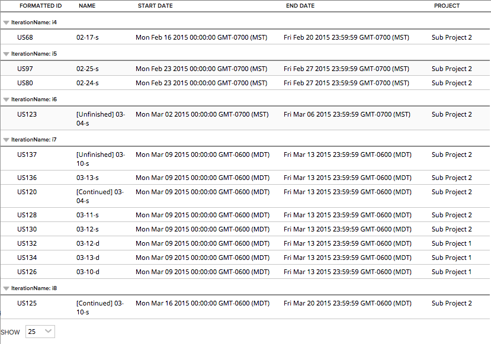

Scheduled Stories updated in last 60 days
=========================

## Overview

This example shows how to use promises to hydrate a reference object

This app is available AS IS. It is not supported by Rally support.
## License

AppTemplate is released under the MIT license.  See the file [LICENSE](./LICENSE) for the full text.

##Documentation for SDK

You can find the documentation on our help [site.](https://help.rallydev.com/apps/2.0/doc/)
